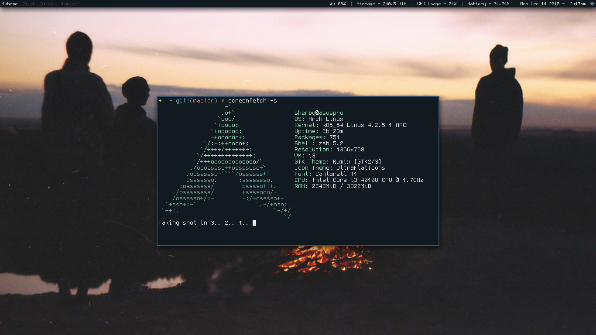

# dotfiles

Configs and dotfiles

- OS: Arch Linux
- Terminal: zsh + oh my zsh + rxvt-unicode
- WM/DE: i3-gaps (AUR) / XFCE4
- File Manager: Thunar
- Text Editor: Sublime Text 3 / nano
- Video: mplayer+smplayer
- Torrents: qBittorrent
- Compiste Manager: compton

# Screenshot

Format: 